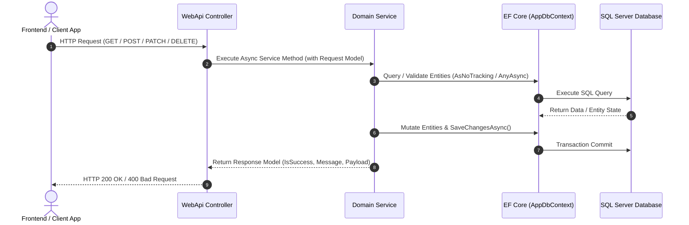

# Online Class Management System

A robust, layered .NET 8 Web API solution designed for managing online classes, student enrollments, schedules, subjects, and teaching plans.

---

## 📌 Project Overview

The **Online Class Management System** is built using ASP.NET Core Web API and Entity Framework Core following a decoupled, layered architecture. It provides RESTful APIs for managing sub-classes, registering student enrollments with automatic capacity tracking, managing users/teachers, and handling schedules and teaching plans.

### Tech Stack
- **Framework**: .NET 8.0
- **API Engine**: ASP.NET Core Web API
- **ORM**: Entity Framework Core 8.0 (SQL Server)
- **Documentation**: Swagger / OpenAPI (Swashbuckle)

---

## 🏗️ Architecture & Project Structure

```text
OnlineClassManagementSystem/
├── OnlineClassManagementSystem.Database/       # Database Context & EF Core Entity Models
│   └── Models/
│       ├── AppDbContext.cs
│       ├── TblSubClass.cs
│       ├── TblEnrollment.cs
│       ├── TblUser.cs
│       ├── TblSubject.cs
│       ├── Schedule.cs
│       └── TeachPlan.cs
├── OnlineClassManagementSystem.Domain/         # Business Logic, Feature Services & DTO Models
│   ├── features/
│   │   ├── SubClass/
│   │   │   └── SubClassService.cs
│   │   └── Enrollment/
│   │       └── EnrollmentService.cs
│   └── models/                                 # Request & Response DTO Models
│       ├── SubClass*.cs
│       └── Enrollment*.cs
└── OnlineClassManagementSystem.WebApi/         # REST API Controllers & Program Setup
    ├── Controllers/
    │   ├── SubClassController.cs
    │   └── EnrollmentController.cs
    ├── appsettings.json
    └── Program.cs
```

---

## 🔄 System Workflow



### Detailed Feature Workflows

#### 1. SubClass Creation Workflow
1. Client submits class details (`ClassName`, `Place`, `OpenDate`, `OpenTime`, `StudentLimit`).
2. `SubClassService` validates required fields and checks for duplicate class names or overlapping place/date/time.
3. Class is saved to `Tbl_SubClass` with initial `StudentCount = 0`.

#### 2. Enrollment Workflow
1. Client requests enrollment with `ClassId` and `StudentId`.
2. `EnrollmentService` verifies:
   - Target `SubClass` exists and is active (`!IsDelete`).
   - Target `Student` exists and is active.
   - Student is not already enrolled in the class.
   - Class capacity has not reached `StudentLimit`.
3. Adds record to `Tbl_Enrollments` and automatically increments `StudentCount` in `Tbl_SubClass`.

#### 3. Enrollment Cancellation / Soft Delete Workflow
1. Client requests deletion of an enrollment by `EnrollmentId`.
2. `EnrollmentService` marks `Tbl_Enrollments.IsDelete = true`.
3. Automatically decrements `StudentCount` in `Tbl_SubClass`.

---

## ✨ Features List

### 🏫 SubClass Management
- **Get All SubClasses**: Fetch list of non-deleted sub-classes.
- **Get SubClass by ID**: Retrieve specific class details.
- **Create SubClass**: Add new class with validations on duplicate name and schedule conflicts.
- **Patch SubClass**: Partial updates for class name, location, dates, times, and student limits.
- **Delete SubClass**: Soft delete sub-class by setting `IsDelete = true`.

### 🎓 Enrollment Management
- **Get All Enrollments**: Retrieve active student class enrollments with class & student details.
- **Get Enrollment by ID**: Fetch enrollment info by ID.
- **Create Enrollment**: Enroll student into a class with capacity limit checks & automatic count increment.
- **Patch Enrollment**: Update enrolled class or student with automatic capacity adjustment across old and new classes.
- **Delete Enrollment**: Soft delete enrollment record and automatically decrement class student count.

### 👤 User & Course Infrastructure
- Data models for `TblUser` (Students & Teachers), `TblSubject`, `Schedule`, and `TeachPlan`.

---

## ✅ Implementation Checklist

- [x] Solution setup with Clean Architecture layout (.Database, .Domain, .WebApi)
- [x] Entity Framework Core models & DbContext configuration (`AppDbContext`)
- [x] **SubClass Feature**
  - [x] `SubClassService` implementation
  - [x] Request/Response models (`SubClassList`, `SubClassEdit`, `SubClassCreate`, `SubClassPatch`, `SubClassDelete`)
  - [x] `SubClassController` endpoints (`GET`, `POST`, `PATCH`, `DELETE`)
- [x] **Enrollment Feature**
  - [x] `EnrollmentService` implementation
  - [x] Request/Response models (`EnrollmentList`, `EnrollmentEdit`, `EnrollmentCreate`, `EnrollmentPatch`, `EnrollmentDelete`)
  - [x] `EnrollmentController` endpoints (`GET`, `POST`, `PATCH`, `DELETE`)
  - [x] Automatic capacity check & `StudentCount` synchronization
- [x] Dependency Injection configuration in `Program.cs`
- [x] Solution build verification (0 Errors)
- [ ] **Future Enhancements / Backlog**
  - [ ] Subject Service & Controller (`TblSubject`)
  - [ ] Schedule Service & Controller (`Schedule`)
  - [ ] Teach Plan Service & Controller (`TeachPlan`)
  - [ ] Authentication & Authorization (JWT integration)
  - [ ] Unit Tests & Integration Tests

---

## 🚀 Getting Started

### Prerequisites
- [.NET 8.0 SDK](https://dotnet.microsoft.com/download/dotnet/8.0)
- SQL Server (LocalDB or Express / Full Instance)

### Configuration
Update the database connection string in `OnlineClassManagementSystem.WebApi/appsettings.json`:

```json
{
  "ConnectionStrings": {
    "DbConnection": "Server=YOUR_SERVER_NAME;Database=OnlineClassDb;Trusted_Connection=True;TrustServerCertificate=True;"
  }
}
```

### Running the API

```bash
# Build the solution
dotnet build

# Run the Web API project
dotnet run --project OnlineClassManagementSystem.WebApi
```

Once running, navigate to `https://localhost:7196/swagger` (or your configured port) to test endpoints using Swagger UI.

---

## 📡 API Endpoints Summary

| Feature | Method | Endpoint | Description |
| :--- | :--- | :--- | :--- |
| **SubClass** | `GET` | `/api/SubClass` | Get all active sub-classes |
| **SubClass** | `GET` | `/api/SubClass/{SubClassId}` | Get sub-class details by ID |
| **SubClass** | `POST` | `/api/SubClass` | Create new sub-class |
| **SubClass** | `PATCH` | `/api/SubClass/{id}` | Partially update sub-class details |
| **SubClass** | `DELETE` | `/api/SubClass/{SubClassId}` | Soft delete sub-class |
| **Enrollment** | `GET` | `/api/Enrollment` | Get all active enrollments |
| **Enrollment** | `GET` | `/api/Enrollment/{EnrollmentId}` | Get enrollment by ID |
| **Enrollment** | `POST` | `/api/Enrollment` | Create new student enrollment |
| **Enrollment** | `PATCH` | `/api/Enrollment/{id}` | Update enrollment details |
| **Enrollment** | `DELETE` | `/api/Enrollment/{EnrollmentId}` | Soft delete enrollment |
